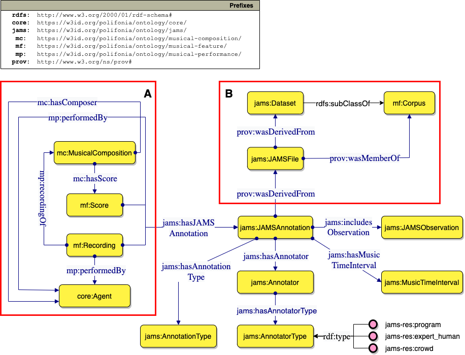
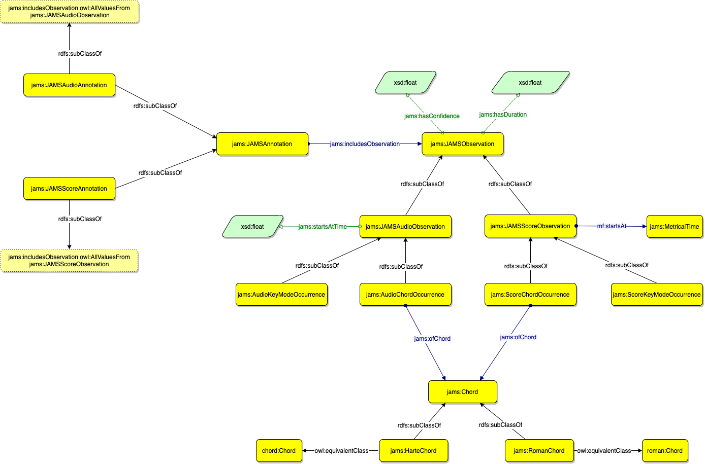

# JAMS Ontology

The JAMS ontology module of the [Polifonia ontology network](https://github.com/polifonia-project/ontology-network) provides a comprehensive schema to describe JAMS files and their annotations.

The complete documentation of the ontology can be found at [https://polifonia-project.github.io/jams-ontology/](https://polifonia-project.github.io/jams-ontology/).

## Competency questions addressed by this ontology module

| **ID**   | **Competency question**                                                                                            |
| -------- | ------------------------------------------------------------------------------------------------------------------ |
| **CQ1**  | What is the content of the observations contained in a JAMS Annotation?                                            |
| **CQ2**  | Who is the composer of a musical object?                                                                           |
| **CQ3**  | Who is the performer of a musical object?                                                                          |
| **CQ4**  | Who/what is the annotator of an annotation/observation, and what is its type?                                      |
| **CQ5**  | What is the time frame addressed by an annotation, within a musical object?                                        |
| **CQ6**  | What is its start time \(i\.e\. the starting time of the time frame\)?                                             |
| **CQ7**  | Which are the observations included in an annotation?                                                              |
| **CQ8**  | Given an observation, what is the starting point of the time frame it addresses, within its target musical object? |
| **CQ9**  | Given an observation, what is its addressed time frame, within its target musical object?                          |
| **CQ10** | What is the key of a composition/performance?                                                                      |
| **CQ11** | What is the value of an observation?                                                                               |
| **CQ12** | What is the confidence of an observation?                                                                          |
| **CQ13** | What are the chords of a composition/performance?                                                                  |

## Imported ontologies

### Imported from the Polifonia Ontology Network

- [Core Module](https://github.com/polifonia-project/core-ontology/)
- [Musical Composition Module](https://github.com/polifonia-project/musical-composition-ontology/)
- [Musical Features Module](https://github.com/polifonia-project/musical-features-ontology/)
- [Musical Performance](https://github.com/polifonia-project/musical-performance-ontology/)
- [Roman Chord](https://github.com/polifonia-project/roman-chord-ontology/)

### External Imports

- [Chord Ontology](http://motools.sourceforge.net/chord_draft_1/chord.html)

## Ontology Description

This ontology makes it possible to describe structured annotations from a JAMS file, as described in:

```
Eric J. Humphrey, Justin Salamon, Oriol Nieto, Jon Forsyth, Rachel M. Bittner, and Juan P. Bello,
"JAMS: A JSON Annotated Music Specification for Reproducible MIR Research",
Proceedings of the 15th International Conference on Music Information Retrieval, 2014.
```

JAMS is a JSON-based music annotation format whioch aims to provide a simple, structured, and sustainable approach to representing rich information in a human-readable, language agnostic format.
JAMS is not only a formal scheme, but also a set of software tools that has been implemented to interact with this scheme. The annotation and software specifications can be found in the [official documentation](https://jams.readthedocs.io/en/stable/).

However, the objective of this ontology module is not only to recreate the structure of a JAMS file in an RDF serialisation. Instead, the aim of this module of the Polifonia Ontology Network is to enrich the JAMS model with new information that is semantically consistent.

### JAMS Annotation



### JAMS Observation

The JAMS Ontology allows different types of JAMS Observation to be modelled.
For the sake of clarity, two different types are shown here in separate diagrams.



## Bibliography

1. Eric J. Humphrey, Justin Salamon, Oriol Nieto, Jon Forsyth, Rachel M. Bittner, and Juan P. Bello,
   "JAMS: A JSON Annotated Music Specification for Reproducible MIR Research",
   Proceedings of the 15th International Conference on Music Information Retrieval, 2014.
2. Harte, Christopher & Sandler, Mark & Abdallah, Samer & Gómez, Emilia. (2005). Symbolic Representation of Musical Chords: A Proposed Syntax for Text Annotations.. 66-71.
3. Raimond, Yves & Abdallah, Samer & Sandler, Mark & Giasson, Frederick. (2007). The Music Ontology. Proceedings of the 8th International Conference on Music Information Retrieval, ISMIR 2007.

## License

This work is licensed under a
[Creative Commons Attribution 4.0 International License][cc-by].


[cc-by]: http://creativecommons.org/licenses/by/4.0/
