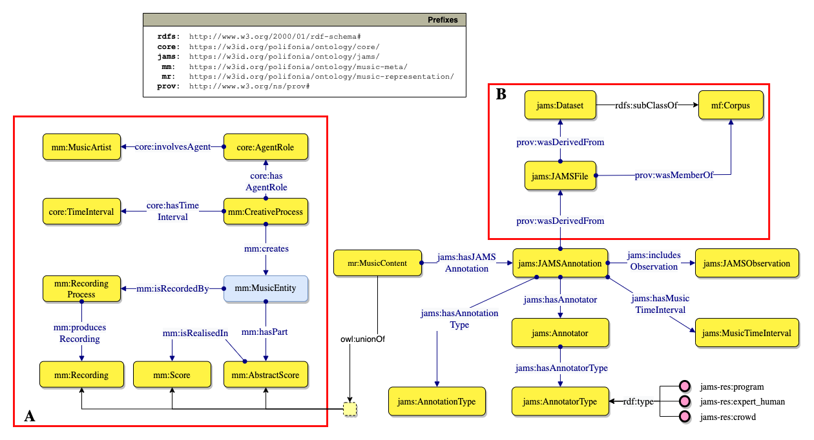
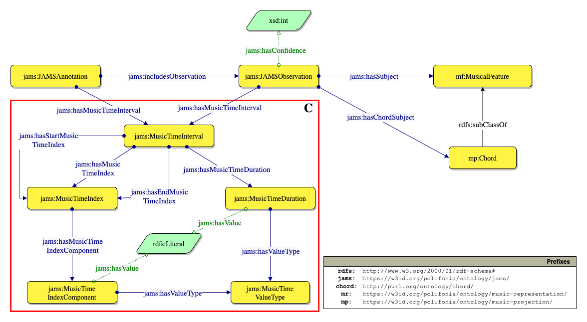

# JAMS Ontology

[](https://zenodo.org/badge/latestdoi/372536364)
[](https://creativecommons.org/licenses/by/4.0/)

> 🔗 Ontology URI: [https://w3id.org/polifonia/ontology/jams/](https://w3id.org/polifonia/ontology/jams/)
>
> 📑 Ontology Documentation: [https://polifonia-project.github.io/jams-ontology/](https://polifonia-project.github.io/jams-ontology/)

The JAMS ontology mimics the structure of a JAMS (JSON Annotated Music Specification for Reproducible MIR Research) document.
It semantically describes and connects all the elements of the JAMS specification (Annotatio, Observation, etc.),  including the music metadata and the annotation contents using the [Music Meta](https://github.com/polifonia-project/music-meta-ontology) and [Music Representation](https://github.com/polifonia-project/music-representation-ontology) modules, respectively.

JAMS is a JSON-based music annotation format whioch aims to provide a simple, structured, and sustainable approach to representing rich information in a human-readable, language agnostic format.
JAMS is not only a formal scheme, but also a set of software tools that has been implemented to interact with this scheme. The annotation and software specifications can be found in the [official documentation](https://jams.readthedocs.io/en/stable/).


### JAMS Annotation

The model describes the metadata of the music piece (box `A`), by reusing the [Music Meta](https://github.com/polifonia-project/music-meta-ontology) and [Music Representation](https://github.com/polifonia-project/music-representation-ontology) modules of PON. 
Moreover, music annotations are described (i.e. the output of a human expert or computational process aimed at identifying music elements, such as chords), together with information about the annotation process and the provenance of such annotations (box `B`).



### JAMS Observation

For each Annotation, the contained Observation are described. 
The `C` box highlights how temporal information is modelled. 



## Competency questions addressed

| **ID**   | **Competency question**                                                                                            |
| -------- | ------------------------------------------------------------------------------------------------------------------ |
| **CQ1**  | What is the content of the observations contained in a JAMS Annotation?                                            |
| **CQ2**  | Who is the composer of a musical object?                                                                           |
| **CQ3**  | Who is the performer of a musical object?                                                                          |
| **CQ4**  | Who/what is the annotator of an annotation/observation, and what is its type?                                      |
| **CQ5**  | What is the time frame addressed by an annotation, within a musical object?                                        |
| **CQ6**  | What is its start time \(i\.e\. the starting time of the time frame\)?                                             |
| **CQ7**  | Which are the observations included in an annotation?                                                              |
| **CQ8**  | Given an observation, what is the starting point of the time frame it addresses, within its target musical object? |
| **CQ9**  | Given an observation, what is its addressed time frame, within its target musical object?                          |
| **CQ10** | What is the key of a composition/performance?                                                                      |
| **CQ11** | What is the value of an observation?                                                                               |
| **CQ12** | What is the confidence of an observation?                                                                          |
| **CQ13** | What are the chords of a composition/performance?                                                                  |

## SPARQL queries addressed

- _Which are the first 10 chords of "Michelle" by The Beatles, ordered by onset?_

```sparql
PREFIX jams: <http://w3id.org/polifonia/ontology/jams/>
PREFIX mp:  <http://w3id.org/polifonia/ontology/musical-performance/>
PREFIX mc:  <http://w3id.org/polifonia/ontology/musical-composition/>
PREFIX rdfs: <http://www.w3.org/2000/01/rdf-schema#>

SELECT DISTINCT ?observationValue ?startTime ?startTimeType ?duration ?durationType
WHERE {
  ?recording a mp:Recording ;
    mc:hasTitle "Michelle" ;
    jams:hasJAMSAnnotation ?annotation .
  ?annotation jams:includesObservation ?observation ;
    jams:hasAnnotationType "chord" .
  ?observation rdfs:label ?observationValue ;
    jams:hasMusicTimeInterval [jams:hasMusicTimeDuration [ jams:hasValue ?duration ; jams:hasValueType ?durationType ] ;
      jams:hasMusicTimeStartIndex [ jams:hasMusicTimeIndexComponent [ jams:hasValue ?startTime ; jams:hasValueType ?startTimeType  ]]] .
} 
ORDER BY (?startTime)
LIMIT 10
```

## Imported ontologies

### Direct imports
- [JAMS Onotlogy](https://w3id.org/polifonia/ontology/jams)

### Indirect imports
- [Core Onotlogy](https://w3id.org/polifonia/ontology/core)
- [Musi Meta Onotlogy](https://w3id.org/polifonia/ontology/music-meta)
- [Music Representation Onotlogy](https://w3id.org/polifonia/ontology/music-representation)
- [Music Projection Onotlogy](https://w3id.org/polifonia/ontology/music-projection)

## Aligned ontologies
- [Chord Ontology](https://motools.sourceforge.net/chord_draft_1/chord.html)

## Datasets
The following datasets reuse the JAMS Ontology:
- [ChoCo Knowledge Graph](https://polifonia.disi.unibo.it/choco/sparql) (~30M triples)

## Statistics
We report the following statistics for the Music Annotation module: 
- number of classes: 208 
- number of object properties: 207
- number of datatype properties: 27
- number of logical axioms: 1237

## License

This work is licensed under a
[Creative Commons Attribution 4.0 International License][cc-by].


[cc-by]: http://creativecommons.org/licenses/by/4.0/


## Bibliography

1. Eric J. Humphrey, Justin Salamon, Oriol Nieto, Jon Forsyth, Rachel M. Bittner, and Juan P. Bello,
   "JAMS: A JSON Annotated Music Specification for Reproducible MIR Research",
   Proceedings of the 15th International Conference on Music Information Retrieval, 2014.
2. Harte, Christopher & Sandler, Mark & Abdallah, Samer & Gómez, Emilia. (2005). Symbolic Representation of Musical Chords: A Proposed Syntax for Text Annotations.. 66-71.
3. Raimond, Yves & Abdallah, Samer & Sandler, Mark & Giasson, Frederick. (2007). The Music Ontology. Proceedings of the 8th International Conference on Music Information Retrieval, ISMIR 2007.
